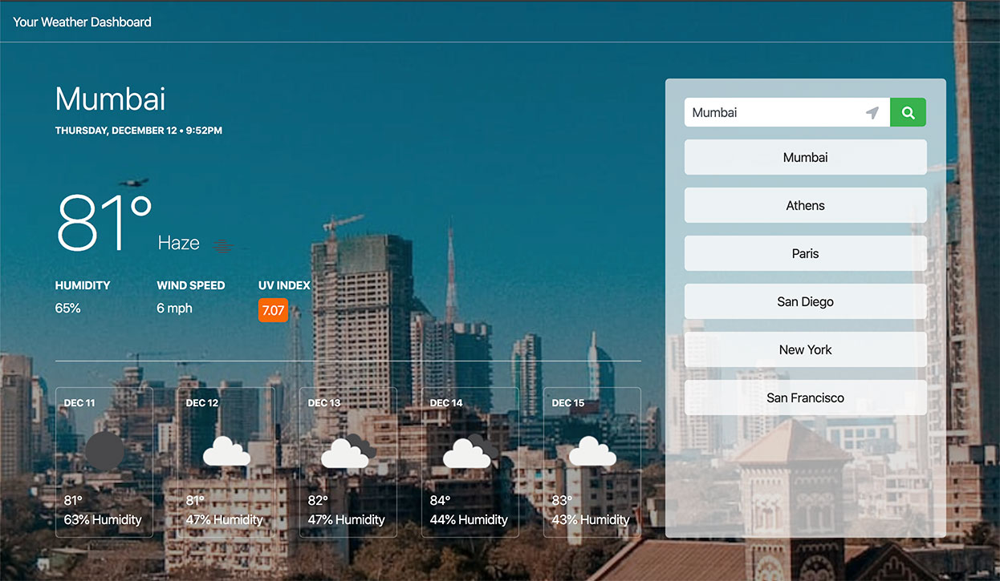
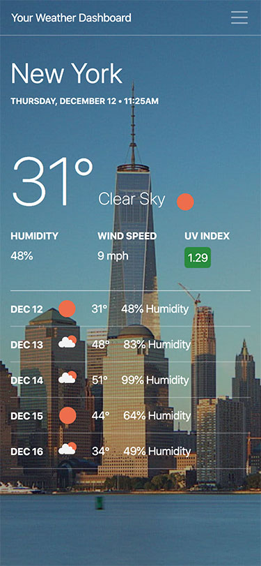

# Work Day Planner

## Summary

This application delivers the current weather conditions and five day forecast right to your fingertips. Search for any city or use your current location to see what the sky is up to anywhere in the world along with a lovely picture of your chosen destination.

## Prerequisites

- Web Browser (Chrome, Safari, Firefox, etc)
- [JavaScript](https://enablejavascript.co/)
- [Local Storage](https://voicethread.com/howto/enabling-cookies/)

## Installing

Copy the repository link.

```
https://github.com/amandalatkins/weather-dashboard.git
```

Clone the repository to your local development environment

```
git clone https://github.com/amandalatkins/weather-dashboard.git
```

Open ``index.html`` in your preferred web browser

## Built With

* [HTML](https://developer.mozilla.org/en-US/docs/Web/HTML)
* [CSS](https://developer.mozilla.org/en-US/docs/Web/CSS)
* [JavaScript](https://developer.mozilla.org/en-US/docs/Web/JavaScript)
* [Moment.js](https://momentjs.com/)
* [Bootstrap](https://getbootstrap.com)
* [OpenWeather API](https://openweathermap.org/api)
* [Teleport API](https://developers.teleport.org/api/)

## Deployed Link

* [See Live App](https://amandalatkins.github.io/weather-dashboard)

## Screenshots




## Code Snippets

The following snippet shows the function that receives and handles a search input, whether from a clicking the search button, clicking the current location button, or pressing the enter key.

```
    function initSearch(e) {

        var searchField = $('#searchField');

        if (e.target.matches('button')) {   
            if ($(e.target).attr('id') === "searchBtn") {
                if (searchField.val() === "") {
                    return;
                }
                currentCity = searchField.val();
                searchField.val('');
                runSearch();
                if ($(window).width() < 992) {
                toggleMobileSearch();
            }
            } else if ($(e.target).attr('id') !== "currentLocation") {
                currentCity = $(e.target).val();
                searchField.val('');
                runSearch();
                if ($(window).width() < 992) {
                    toggleMobileSearch();
                }
            }
        } 
        // Else if there was an enter key pressed while in the search field
        else if (e.keyCode === 13) {
            if (searchField.val() === "") {
                return;
            }
            currentCity = searchField.val();
            searchField.val('');
            runSearch();
            if ($(window).width() < 992) {
                toggleMobileSearch();
            }
        }

    }
```

## Authors

* ### Amanda Atkins
    - [Portfolio](https://digitalrainstorm.com)
    - [Github](https://github.com/amandalatkins)
    - [LinkedIn](https://www.linkedin.com/in/amandalatkins)

See also the list of [contributors](https://github.com/amandalatkins/weather-dashboard/contributors) who participated in this project.

## License

This project is licensed under the MIT License.

Search icon and current location icon are licensed under [Font Awesome's Free License](https://fontawesome.com/license/free).

Weather data from [OpenWeatherMap.org](https://openweathermap.org/terms) is licensed under the [Creative Commons Attribution-ShareAlike 4.0 Generic License](https://creativecommons.org/licenses/by-sa/4.0/) license

All photos licensed through [Teleport.org](https://developers.teleport.org/api/getting_started/#photos_ua) with Creative Commons licenses.

## Acknowledgments

* [Font Awesome](https://fontawesome.com/) for the current location and search icons
* [Teleport](https://teleport.org) for the various city images
* [OpenWeather](https://openweathermap.org) for all weather data